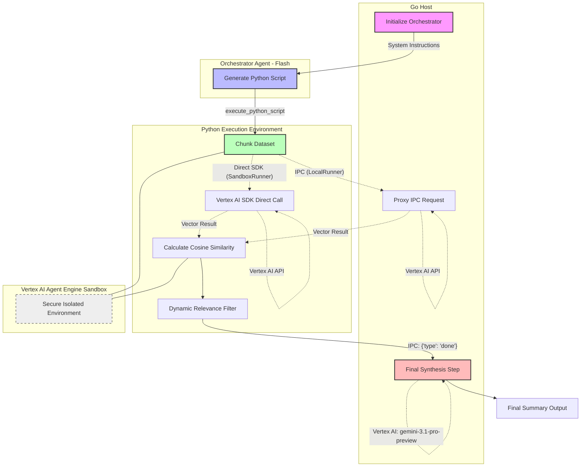

# Agentic RAG Process Workflow

This diagram illustrates the multi-model, multi-process lifecycle of a single Agentic RAG request.

## Workflow Steps

1.  **Orchestration**: Go initializes Gemini Flash with a set of "cost-optimizing" instructions.
2.  **Code Generation**: Flash generates a specialized Python script for the specific query.
3.  **Execution Environment**:
    - **LocalRunner**: Executes Python via `os/exec`. Communicates with Go via a JSON IPC channel for embeddings and sub-agent calls.
    - **SandboxRunner**: Executes Python in a secure Vertex AI Agent Engine Sandbox. Python can use the `vertexai` SDK directly for embeddings and sub-agents, or continue to use IPC if desired.
4.  **Data Processing**: Python reads the context file (`context.txt` in sandbox or local) and chunks it.
5.  **Embedding Generation**: Python obtains vectors for each chunk either via IPC (Go proxy) or directly via the Vertex AI SDK.
6.  **Vector Search**: Similarity is calculated locally in Python to avoid high LLM context costs.
7.  **Dynamic Filtering**: The script dynamically selects the most relevant content (e.g. > 0.75 similarity).
8.  **Final Synthesis**: Only the "distilled" chunks are sent to Gemini Pro for the final high-quality summary.
