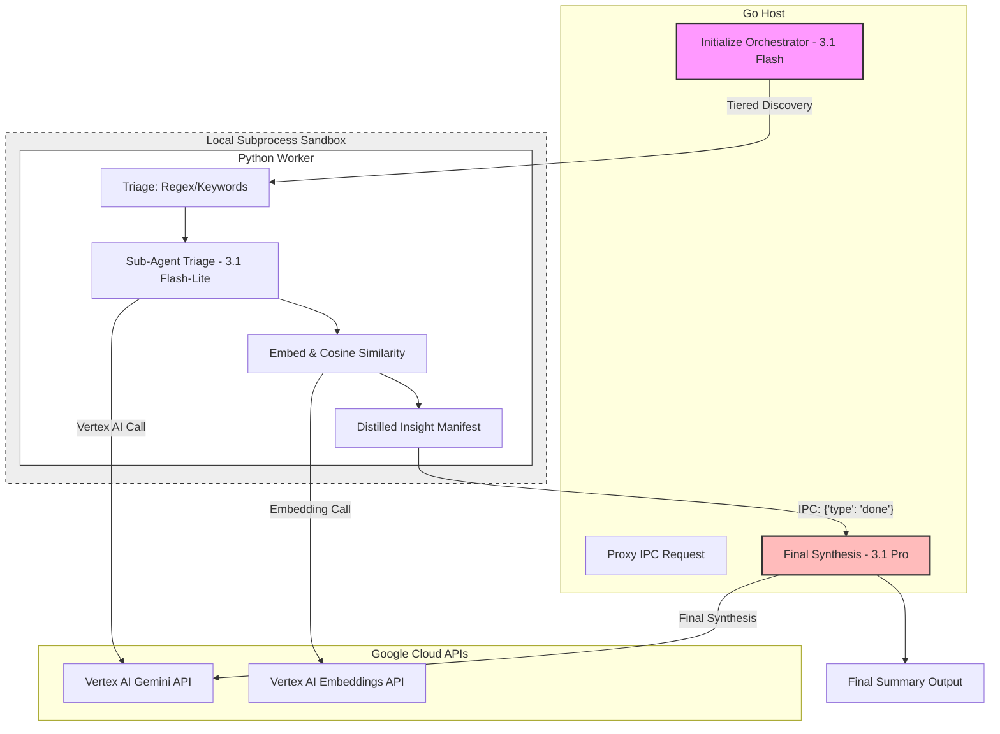

# Agentic RAG Process Workflow (Gemini 3.1)

This diagram illustrates the multi-model, multi-process lifecycle of a single Agentic RAG request using a Local IPC Swarm architecture and Pure-Python analytical algorithms.

## Workflow Steps

1.  **Context Generation**: Go initializes an ultra-massive unstructured dataset filled with distractor noise and isolated "needle" strings.
2.  **File Storage**: The dataset is written to a local temp file, bypassing standard HTTP payload limits.
3.  **Orchestration**: Go initializes `gemini-3.1-flash` with a set of "cost-optimizing" analytical search instructions.
4.  **Code Generation**: The Orchestrator generates a specialized Python script tailored to the dynamic query, utilizing pre-injected analytical tools like `BM25`.
5.  **Execution Environment**: The Go host invokes a local Python 3 subprocess.
6.  **Lexical Filter (Python)**: Python parses millions of lines and aggressively shrinks them down to ~500 top candidates natively using a BM25 TF-IDF approximation.
7.  **Embedding Generation (IPC)**: Python obtains vectors for the 500 candidate chunks by batching them over an IPC (Standard I/O) JSON pipe to the Go host, which calls `text-embedding-004` (or `gemini-embedding-001`).
8.  **Vector Search (Python)**: Cosine Similarity and Standard Deviation calculation are run locally in Python to avoid high LLM context costs. Outlier chunks are selected.
9.  **Swarm Map-Reduce (IPC)**: The highest-scoring chunks are dispatched to a concurrent swarm of `gemini-3.1-flash-lite` Sub-Agents. These sub-agents run simultaneously to extract concise causal evidence and text clues from the chunks.
10. **Recursive Vector Expansion**: Extracted clues are re-embedded. The query vector is mathematically updated (`update_vector_rocchio`), dragging the semantic center toward the new clues. The script recursively repeats steps 6-9, tracing multi-hop context across the dataset.
11. **Final Synthesis**: Only the highly compressed "distilled" clues are returned to Go and sent to `gemini-3.1-pro` for a polished, highly accurate reasoning output.

