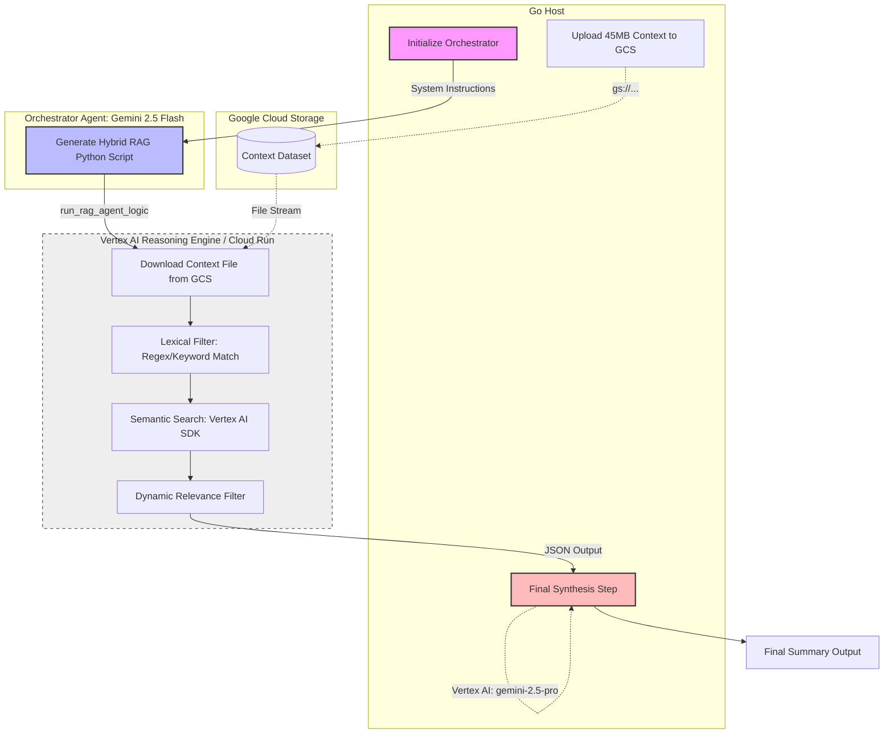

# Agentic RAG Process Workflow

This diagram illustrates the multi-model, multi-process lifecycle of a single Agentic RAG request using the modern Vertex AI Reasoning Engines.

## Workflow Steps

1.  **Context Generation**: Go initializes the 45MB ultra-massive dataset.
2.  **Cloud Storage**: The dataset is uploaded to GCS to bypass standard HTTP payload limits.
3.  **Orchestration**: Go initializes `gemini-2.5-flash` with a set of "cost-optimizing" hybrid search instructions.
4.  **Code Generation**: Flash generates a specialized Python script tailored to the dynamic query.
5.  **Execution Environment**: The Go host invokes the `:query` endpoint of the deployed Vertex AI Reasoning Engine.
6.  **Data Processing (In-Cloud)**: Python runs inside the sandbox, pulling the context file from GCS.
7.  **Lexical Filter**: Python shrinks 1.2 million lines down to ~500 chunks using keyword matching.
8.  **Embedding Generation**: Python obtains vectors for the 500 chunks using the `vertexai` SDK.
9.  **Vector Search**: Cosine Similarity is calculated locally in Python to avoid high LLM context costs.
10. **Final Synthesis**: Only the "distilled" chunks are returned to Go and sent to `gemini-2.5-pro` for the final high-quality summary.
