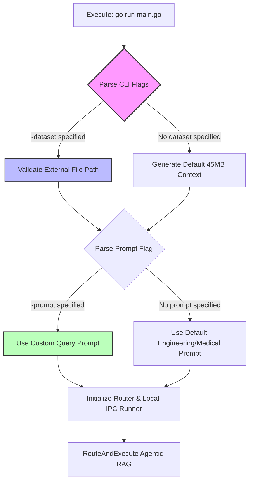

# Specification: External Dataset & Prompt CLI Interface

## Objective
Enhance the Code Sandbox REPL RAG application (`cmd/sandbox/main.go`) to support arbitrary external datasets and custom query prompts via command-line flags (`-dataset` and `-prompt`), allowing users to easily ingest and analyze any enterprise log file, document corpus, or JSONL export.

---

## Architecture & CLI Workflow



### 1. CLI Flags Definition
We will utilize the Go standard library `flag` package to define robust command-line options in `cmd/sandbox/main.go`.

| Flag | Type | Default | Description |
| :--- | :--- | :--- | :--- |
| `-dataset` | `string` | `""` | Absolute or relative path to an external dataset/log file to analyze. |
| `-prompt` | `string` | `""` | Custom query instruction for the Orchestrator to execute against the dataset. |

---

## Implementation Details

### 1. `cmd/sandbox/main.go` Modifications
```go
func main() {
    datasetPath := flag.String("dataset", "", "Path to external dataset/log file (if empty, generates synthetic 45MB context)")
    customPrompt := flag.String("prompt", "", "Custom query instruction (if empty, uses default multi-scenario prompt)")
    flag.Parse()

    var contextFilePath string
    var cleanup func()

    if *datasetPath != "" {
        // Validate file existence
        if _, err := os.Stat(*datasetPath); err != nil {
            slog.Error("Provided dataset file does not exist", "path", *datasetPath, "error", err)
            os.Exit(1)
        }
        contextFilePath = *datasetPath
        cleanup = func() {} // No cleanup needed for user-provided files
        slog.Info("Using external dataset", "path", contextFilePath)
    } else {
        // Existing synthetic generation behavior
        spinner := ui.NewSpinner("Generating 45MB ultra-massive context dataset...")
        // ...
    }

    prompt := `Begin your task...` // Default
    if *customPrompt != "" {
        prompt = *customPrompt
        slog.Info("Using custom query prompt", "prompt", prompt)
    }

    // Execute Router
    router.RouteAndExecute(ctx, contextFilePath, prompt)
}
```

---

## Execution Protocol & Usage

Once implemented, users can seamlessly run the orchestrator against any local dataset:

```bash
# Analyze an external Apache/Nginx log file
go run cmd/sandbox/main.go -dataset=/var/log/nginx/access.log -prompt="Identify all IP addresses that attempted SQL injection attacks."

# Analyze our newly generated synthetic cascading failure JSONL dataset
go run cmd/sandbox/main.go -dataset=/path/to/cascading_failure.jsonl -prompt="Find the root cause of the Redis eviction spike."
```

---

## User Review Required

🛑 **STOPPING EXECUTION PER USER RULE 1.2**

Please review the specification above. Reply with **"Spec approved"** to authorize implementation of the CLI flag enhancements in `cmd/sandbox/main.go`.
