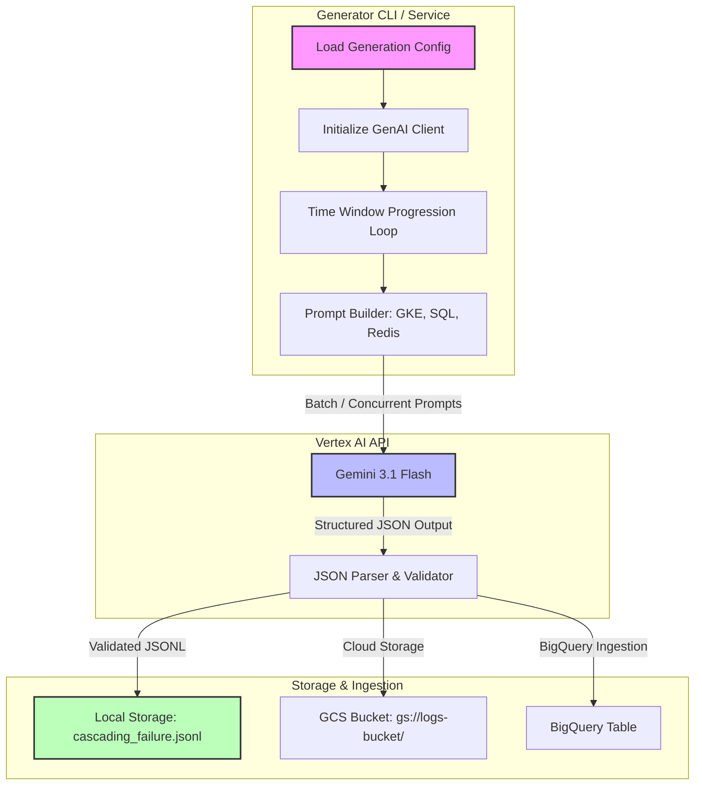

# Specification: Vertex AI Synthetic Cascading Failure Log Generator

## Objective
Design and implement an enterprise-grade synthetic log generator that utilizes Vertex AI Generative Models (`gemini-3.1-flash-preview` / `gemini-1.5-pro`) to produce realistic, structured JSONL log datasets representing cascading failure scenarios across Google Cloud components (GKE, Cloud SQL, MemoryStore/Redis). This dataset will serve as an advanced evaluation benchmark for the Code Sandbox REPL RAG system.

---

## Architecture & Core Components



### 1. Component-Level Prompt Templates
To ensure high-fidelity structured JSON output without markdown wrapping, prompt templates will enforce strict JSON schemas using Gemini's `ResponseSchema` and `ResponseMIMEType` features.

#### A. GKE Pod Application Logs
*   **Target Schema**: `timestamp`, `service_name`, `severity`, `k8s_pod.pod_name`, `k8s_pod.namespace`, `message`.
*   **Incident Behavior**: Transitions from standard HTTP 200 logs (`INFO`) to connection timeouts, Redis connection pool exhaustion, and `OOMKilled` events (`ERROR`/`WARNING`) during peak incident windows.

#### B. Cloud SQL Proxy / PostgreSQL Logs
*   **Target Schema**: `timestamp`, `db_instance`, `client_ip`, `severity`, `query`, `error_code`, `latency_ms`.
*   **Incident Behavior**: Connection limits reached, slow queries (>5000ms), deadlocks, and `FATAL: remaining connection slots are reserved`.

#### C. Cloud MemoryStore (Redis) Logs
*   **Target Schema**: `timestamp`, `redis_instance`, `cmd`, `keyspace_hits`, `keyspace_misses`, `memory_usage_mb`, `evicted_keys`, `message`.
*   **Incident Behavior**: High eviction rates, memory capacity >98%, max memory reached, and slowlog warnings.

---

## Integration & Execution Protocol

### 1. Go Native Execution (`internal/data/llm_generator.go`)
Instead of relying on external Python wrappers, the generator will be natively implemented in Go using the official `google.golang.org/genai` SDK.

```go
type LogEntry struct {
    Timestamp   string         `json:"timestamp"`
    ServiceName string         `json:"service_name"`
    Severity    string         `json:"severity"`
    Payload     map[string]any `json:"payload"`
}
```

### 2. Rate Limiting & Cost Optimization
*   **Concurrency**: Utilizes a worker semaphore (cap 10-20 workers) to respect Vertex AI quota limits.
*   **Model Selection**: Prioritizes `gemini-3.1-flash-preview` with `Temperature: 0.4` for high generation throughput and cost efficiency.
*   **JSON Validation**: Every generated candidate is decoded via `encoding/json` before writing to disk; malformed entries are retried or discarded.

---

## Evaluation Scenarios & Target Queries

The generated JSONL dataset will be injected into our evaluation suite to benchmark the Agentic RAG Router against three cascading failure patterns:

1.  **Engineering Outage Trace**:
    *   *Query*: "Trace the root cause of the GKE API Server outage. Identify the database connection pool exhaustion, the Redis memory eviction spike, and the specific pod OOMKilled event."
2.  **Security & Access Audit**:
    *   *Query*: "Identify all anomalous unauthorized database access attempts and correlate them with firewall rule updates during the 08:15 to 08:30 UTC incident window."

---

## User Review Required

🛑 **STOPPING EXECUTION PER USER RULE 1.2**

Please review the specification above. Reply with **"Spec approved"** to authorize implementation of the Go LLM synthetic generator, prompt templates, and evaluation test harness.
