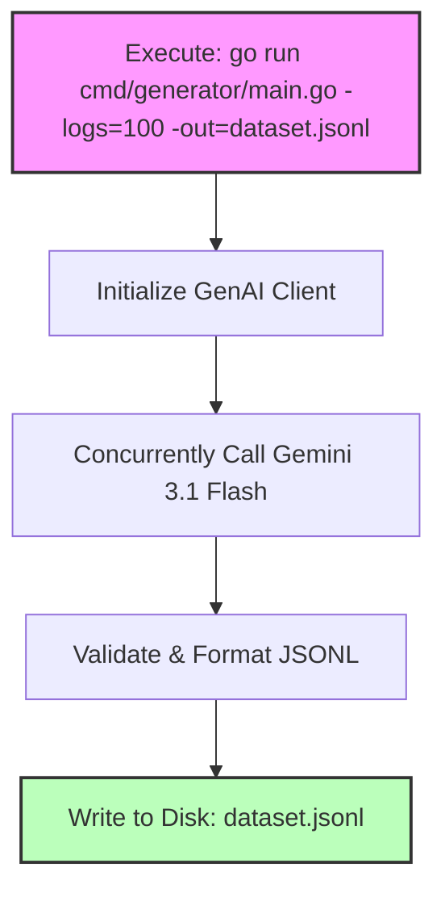

# Specification: Standalone Cascading Failure Dataset Generator CLI

## Objective
Create a standalone Go CLI utility (`cmd/generator/main.go`) and a pre-packaged sample dataset (`testdata/cascading_failure.jsonl`) so users can instantly analyze cascading failure datasets or generate custom-scaled JSONL logs using Vertex AI Generative Models.

---

## Architecture & Workflow



### 1. `cmd/generator/main.go` CLI Flags
| Flag | Type | Default | Description |
| :--- | :--- | :--- | :--- |
| `-logs` | `int` | `100` | Total number of cascading failure log lines to generate. |
| `-out` | `string` | `cascading_failure.jsonl` | Output file path to write the structured JSONL dataset. |

---

## Implementation Details

### 1. Standalone Entry Point (`cmd/generator/main.go`)
```go
func main() {
    numLogs := flag.Int("logs", 100, "Number of logs to generate")
    outPath := flag.String("out", "cascading_failure.jsonl", "Output file path")
    flag.Parse()

    client, _ := ai.NewClient(ctx, projectID, location)
    logs, _ := data.GenerateCascadingFailureLogs(ctx, client, *numLogs)

    file, _ := os.Create(*outPath)
    for _, l := range logs {
        file.WriteString(l + "\n")
    }
    file.Close()
    slog.Info("Dataset generated successfully", "path", *outPath)
}
```

### 2. Sample Static Dataset (`testdata/cascading_failure.jsonl`)
We will also bundle a pre-generated 50-line static cascading failure dataset inside `testdata/` so users can immediately run:
```bash
go run cmd/sandbox/main.go -dataset=testdata/cascading_failure.jsonl -prompt="Trace the root cause of the Redis memory eviction spike."
```

---

## User Review Required

🛑 **STOPPING EXECUTION PER USER RULE 1.2**

Please review the specification above. Reply with **"Spec approved"** to authorize implementation of the standalone generator CLI and static test dataset.
